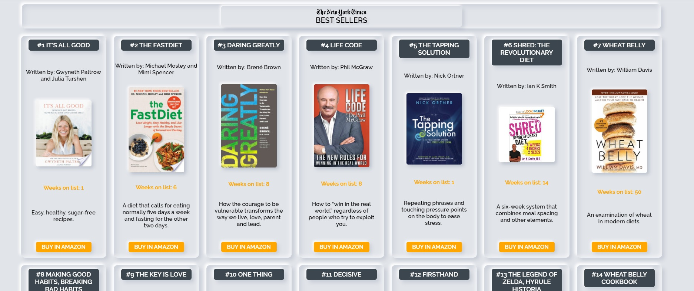

# newYorkTimes_books

<a href="https://sergioiznaoladeveloper.github.io/newYorkTimes_books_proyect/" width="36" height="36" alt="Deploy" /><h2>👉LINK TO APP👈</h2></a>

Utilizando la [API del NYTimes](https://developer.nytimes.com/apis) vamos a crear una biblioteca de los libros más vendidos por temática

